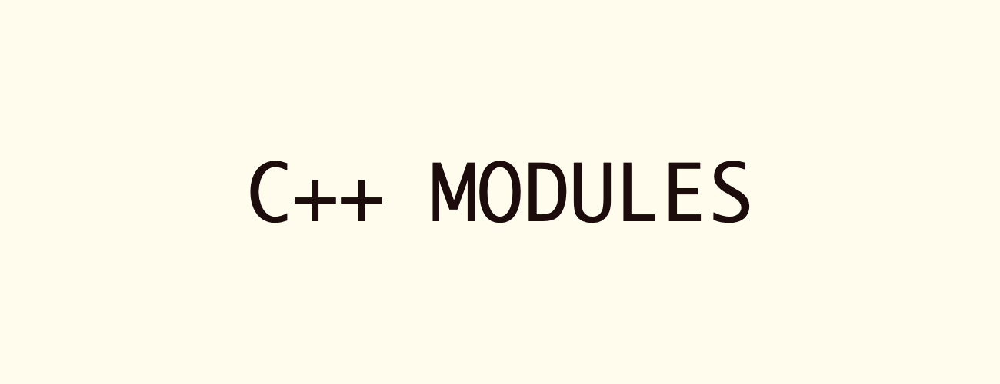

  
  
Introduction to object-oriented programming and C++ through exercises that gradually increase in difficulty.

# About the project
These modules are made in accordance with the CPP-Modules, which are part of the Codam Core Curriculum. Each module introduces new concepts and contains a couple of exercises that gradually increase in difficulty. I was already familiar with C when I begin this project so that made some things a bit easier. The aim is to get experience with object oriented programming and C++. You learn all the fundamentals of OOP in C++. 

# Learnings per module  
**Module00**: namespaces, classes, member functions, constructors, destructors, stdio streams, initialization lists  
**Module01**: memory allocation, new keyword, pointers vs. references, file handling/manipulation, pointers to member functions, switch statements  
**Module02**: ad-hoc polymorphism, operator overloading and orthodox canonical class form  
**Module03**: inheritance  
**Module04**: polymorphism, deep copy vs. shallow copy, abstract base classes  
**Module05**: exceptions  
**Module06**: casting, serialization  
**Module07**:  
**Module08**:  
**Module09**:  

# Contact
See my profile page for ways to contact me!
